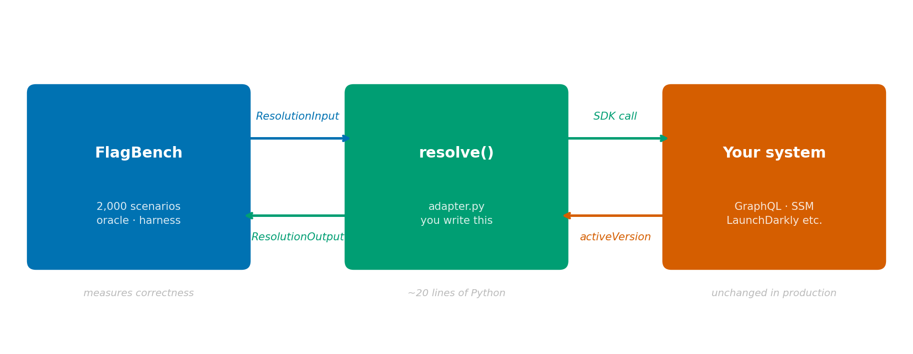

# FlagBench Adapter Guide

> **Goal:** Connect your feature flag system to FlagBench in under 30 minutes and get a formal correctness report.

---

## What FlagBench actually does

FlagBench does **not** replace your flag system. It wraps it. You write one Python function that calls your system; FlagBench feeds it 2,000 pre-built test scenarios and measures four correctness properties that matter in regulated, compliance-aware applications.

Think of it like a test harness for a database driver — you bring your driver, FlagBench brings the test suite.



```
flagbench harness  →  resolve()  →  your flag system
                   ←              ←  selected version
results/summary.json  ← accuracy, latency, compliance violations, pass/fail
```

---

## The four things FlagBench measures

| # | Property | What it means for you |
|---|----------|----------------------|
| 1 | **Determinism** | Same user + route + timestamp always gets the same version. Flapping = non-determinism. |
| 2 | **Fallback safety** | When no version qualifies, your declared fallback is returned — not a random default. |
| 3 | **Compliance precedence** | `approved` versions always win over `pending`/`deprecated` when eligible. Critical for regulated apps. |
| 4 | **Monotonic rollout** | Increasing a version's rollout % never decreases how often it's selected. |

If your system fails any of these, FlagBench tells you exactly which scenario triggered the violation.

---

## Step 1 — Install FlagBench

```bash
git clone https://github.com/RomanFedytskyi/flagbench.git
cd flagbench
pip install -r requirements.txt
```

Verify it works:
```bash
python -m flagbench.harness --adapter reference
# → should print accuracy: 1.0, compliance_violations: 0
```

---

## Step 2 — Understand the input your adapter receives

FlagBench calls your adapter once per scenario with a `ResolutionInput` object:

```python
ResolutionInput(
    user=UserContext(
        user_id="user_abc123",      # who is making the request
        tier="premium",             # standard | premium | admin
        region="US",                # ISO country code
        compliance_group="A",       # your compliance cohort label
    ),
    route=Route(path="/dashboard"), # which page/endpoint is being loaded
    time=TimeWindow(
        timestamp_utc=1704067200.0  # Unix timestamp of the request
    ),
    config=ComponentConfig(
        component_id="checkout-widget",
        fallback_version=VersionSpec(   # ← return this when nothing qualifies
            version_id="v1",
            compliance_status="approved",
            rollout_pct=1.0,
            stability_score=1.0,
        ),
        version_set=[                   # ← all deployable versions of this component
            VersionSpec(version_id="v1", compliance_status="approved",   rollout_pct=1.0, stability_score=0.9),
            VersionSpec(version_id="v2", compliance_status="pending",    rollout_pct=0.5, stability_score=0.7),
            VersionSpec(version_id="v3", compliance_status="deprecated", rollout_pct=0.0, stability_score=0.3),
        ],
    ),
)
```

**Mapping to your system's concepts:**

| FlagBench field | Typical equivalent in flag systems |
|---|---|
| `component_id` | flag key / toggle name / feature name |
| `version_id` | variant name / flag variation / release tag |
| `rollout_pct` | gradual rollout %, user percentage |
| `compliance_status` | custom tag / metadata field you set per variant |
| `user_id` | the identifier used for rollout bucketing |
| `fallback_version` | the "off" / "disabled" / "control" variant |

---

## Step 3 — Write your adapter

Create `flagbench/adapters/my_system.py`:

```python
from flagbench.schema import ResolutionInput, ResolutionOutput, ComplianceStatus


def resolve(inp: ResolutionInput) -> ResolutionOutput:
    """
    Adapter for MyFlagSystem.
    Translate ResolutionInput → your SDK call → ResolutionOutput.
    """
    # --- call your flag system ---
    result = my_sdk.get_variant(
        flag_key=inp.config.component_id,
        user_id=inp.user.user_id,
        context={
            "region": inp.user.region,
            "tier": inp.user.tier,
        },
    )

    # --- translate the response back ---
    if result is None or result.is_disabled:
        # your system returned nothing — use FlagBench's declared fallback
        fb = inp.config.fallback_version
        return ResolutionOutput(
            version_id=fb.version_id,
            is_fallback=True,
            compliance_status=fb.compliance_status,
        )

    # look up full metadata for the selected variant
    selected = next(
        (v for v in inp.config.version_set if v.version_id == result.variant_name),
        inp.config.fallback_version,
    )

    return ResolutionOutput(
        version_id=selected.version_id,
        is_fallback=False,
        compliance_status=selected.compliance_status,
    )
```

That's it. Your adapter only needs to implement `resolve(inp) -> ResolutionOutput`.

---

## Step 4 — Run the benchmark

```bash
python -m flagbench.harness --adapter my_system
```

FlagBench runs all 2,000 scenarios through your adapter and writes:

```
results/summary_my_system.json
```

Example output:
```json
{
  "adapter": "my_system",
  "total_scenarios": 2000,
  "overall": {
    "accuracy": 0.94,
    "fallback_rate": 0.08,
    "latency_ms": { "p50": 1.2, "p90": 4.8, "p99": 12.1, "mean": 2.1 },
    "compliance_violations": 47
  },
  "per_group": {
    "normal_ops":          { "accuracy": 0.97, "compliance_violations": 5 },
    "boundary_conditions": { "accuracy": 0.89, "compliance_violations": 22 },
    "fallback_trigger":    { "accuracy": 1.00, "compliance_violations": 0 },
    "adversarial":         { "accuracy": 0.88, "compliance_violations": 20 }
  }
}
```

---

## Step 5 — Run the property checks

The benchmark above measures *accuracy* against known ground-truth. The property checks are deeper — they test the four formal properties using property-based testing (Hypothesis generates thousands of random inputs):

```bash
python -m flagbench.properties --adapter my_system
```

Or run the Hypothesis oracle directly:
```bash
pytest flagbench/oracle.py -v --hypothesis-seed=0
```

Output written to `results/properties_my_system.json`:
```json
{
  "determinism":           { "pass": true,  "detail": "500/500 calls consistent" },
  "fallback_safety":       { "pass": true,  "detail": "declared fallback always returned" },
  "compliance_precedence": { "pass": false, "detail": "selected 'v2' (pending) when approved v1 eligible" },
  "monotonic_rollout":     { "pass": true,  "detail": "monotonicity holds across 200 seeds" }
}
```

---

## Interpreting your results

### Accuracy

| Score | Meaning |
|-------|---------|
| > 0.95 | Your system correctly resolves the right version in >95% of cases |
| 0.80–0.95 | Moderate drift — likely a bucketing or ordering issue |
| < 0.80 | Significant correctness gap — check compliance ordering and fallback logic |

The reference resolver scores **0.935** overall (lower than 1.0 because the benchmark includes adversarial edge cases by design).

### Compliance violations

A violation means your system selected a `pending` or `deprecated` version when an `approved` version was also eligible. In a regulated application (fintech, healthcare, legal), every violation is a potential audit finding.

The simulated Unleash adapter produces **731 violations** across 2,000 scenarios — vs **139** for the reference resolver. That gap is the paper's central empirical claim.

### Latency

FlagBench measures end-to-end resolution time for your adapter call. Most in-process resolvers land under 1 ms p50. If you see p99 > 50 ms, your system is making a network call inside the resolution path — a common anti-pattern.

### Property failures

| Failed property | Likely cause | Where to look |
|---|---|---|
| Determinism | Random seed not fixed; hash varies by process restart | Bucketing logic, PYTHONHASHSEED sensitivity |
| Fallback safety | SDK returns `null` or variant[0] instead of your declared fallback | Empty eligibility path in your adapter |
| Compliance precedence | Sorting by rollout_pct without filtering by compliance_status first | Version selection/ranking logic |
| Monotonic rollout | Rollout bucket boundaries don't shift consistently | Hash function used for bucketing |

---

## Concrete adapter examples

### LaunchDarkly

```python
import ldclient
from ldclient import Context
from flagbench.schema import ResolutionInput, ResolutionOutput

ldclient.set_sdk_key("your-sdk-key")
ld = ldclient.get()


def resolve(inp: ResolutionInput) -> ResolutionOutput:
    ctx = Context.builder(inp.user.user_id) \
        .set("region", inp.user.region) \
        .set("tier", inp.user.tier.value) \
        .build()

    variation = ld.variation(inp.config.component_id, ctx, inp.config.fallback_version.version_id)

    selected = next(
        (v for v in inp.config.version_set if v.version_id == variation),
        inp.config.fallback_version,
    )
    is_fallback = (variation == inp.config.fallback_version.version_id)

    return ResolutionOutput(
        version_id=selected.version_id,
        is_fallback=is_fallback,
        compliance_status=selected.compliance_status,
    )
```

### Unleash (real SDK)

```python
from UnleashClient import UnleashClient
from flagbench.schema import ResolutionInput, ResolutionOutput

client = UnleashClient(url="https://your-unleash.example.com/api", app_name="flagbench")
client.initialize_client()


def resolve(inp: ResolutionInput) -> ResolutionOutput:
    context = {"userId": inp.user.user_id, "properties": {"region": inp.user.region}}
    enabled = client.is_enabled(inp.config.component_id, context)

    if not enabled:
        fb = inp.config.fallback_version
        return ResolutionOutput(
            version_id=fb.version_id,
            is_fallback=True,
            compliance_status=fb.compliance_status,
        )

    variant = client.get_variant(inp.config.component_id, context)
    version_id = variant.get("name", inp.config.active_version.version_id)
    selected = next(
        (v for v in inp.config.version_set if v.version_id == version_id),
        inp.config.fallback_version,
    )
    return ResolutionOutput(
        version_id=selected.version_id,
        is_fallback=False,
        compliance_status=selected.compliance_status,
    )
```

### Homegrown / REST API flag system

```python
import requests
from flagbench.schema import ResolutionInput, ResolutionOutput

FLAG_API = "https://flags.your-company.com/resolve"


def resolve(inp: ResolutionInput) -> ResolutionOutput:
    resp = requests.post(FLAG_API, json={
        "flag": inp.config.component_id,
        "user_id": inp.user.user_id,
        "attributes": {
            "region": inp.user.region,
            "tier": inp.user.tier.value,
            "timestamp": inp.time.timestamp_utc,
        },
    }, timeout=5)

    if resp.status_code != 200 or not resp.json().get("version"):
        fb = inp.config.fallback_version
        return ResolutionOutput(
            version_id=fb.version_id,
            is_fallback=True,
            compliance_status=fb.compliance_status,
        )

    version_id = resp.json()["version"]
    selected = next(
        (v for v in inp.config.version_set if v.version_id == version_id),
        inp.config.fallback_version,
    )
    return ResolutionOutput(
        version_id=selected.version_id,
        is_fallback=False,
        compliance_status=selected.compliance_status,
    )
```

---

## What you get

After running FlagBench against your system you have:

1. **A correctness score** — a single number (0–1) showing how often your system resolves the right version across 2,000 diverse scenarios.
2. **A compliance gap count** — how many times your system violated compliance ordering (the most common regulatory risk).
3. **A property pass/fail profile** — formal verification of the four properties; publishable evidence of correctness or non-correctness.
4. **A latency baseline** — p50/p90/p99 for your resolution path; identify if you have inadvertent network calls.
5. **Reproducible results** — all scenarios are deterministic (fixed seeds); running again produces the same numbers, making results citable.

These results can be dropped directly into a pull request ("PR adds compliance_precedence fix: violations drop from 47 → 0"), included in an architecture review, or cited in a research paper.

---

## Troubleshooting

**`ModuleNotFoundError: No module named 'my_system'`**  
Your adapter file must be at `flagbench/adapters/my_system.py` — not at the repo root.

**`pydantic.ValidationError` on ComplianceStatus**  
Your adapter returned a `compliance_status` string that isn't one of `"approved"`, `"pending"`, `"deprecated"`. Cast it explicitly: `ComplianceStatus(your_string)`.

**My flag system returns version names that don't match version_set**  
Add a fallback in the lookup: `next((v for v in inp.config.version_set if v.version_id == result), inp.config.fallback_version)`. This prevents a `StopIteration` crash.

**Results differ on every run (non-determinism in my adapter)**  
Your SDK is calling `random` or `hash()` without a fixed seed. For benchmarking purposes, fix the seed in your adapter. The `unleash_sim` adapter demonstrates this pattern.

---

## Questions?

Open an issue at [github.com/RomanFedytskyi/flagbench](https://github.com/RomanFedytskyi/flagbench) or email fedytskyi@gmail.com.
